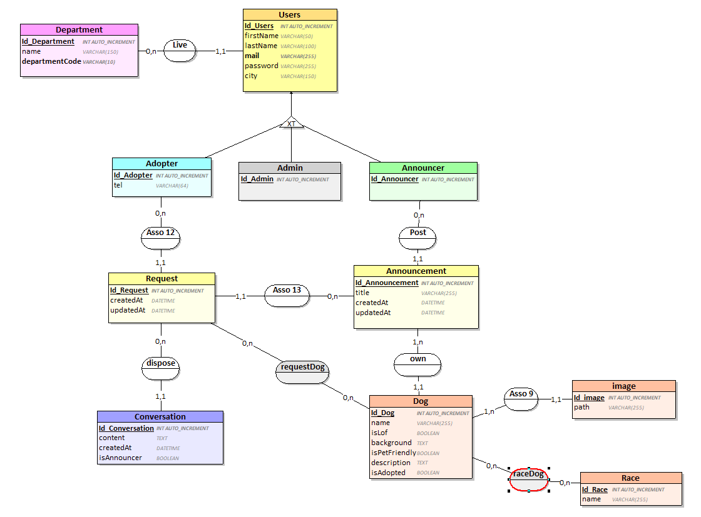

# SPA_project

## Projet de groupe WoofAdopte

Vous trouverez dans la dossier [ressources](ressources/) : 
 - Le fichier Looping de notre shéma BdD
 - La liste des départements français en csv

 Afin de pouvoir tester le projet, des fixtures ont été crée. 

### Notre MCD :

### Conditions de nommage du projet :

- Tout le code du projet doit être écrit en anglais
- Classe : MaClasse
- Fichier : snake_case
- Fichier de classe : MaClasse.php : et j'ajoute (s) à la fin si cette classe représente une collection, ou bien si la classe de l'entité inverse d'une relation ManyToOne se termine avec (s).
- Tout service (toute classe qui n’est pas une Entity) mettre son type en suffixe exemple : MaClasseController.php
- Fichier fixtures : nom de la classe exemple UserFixtures.php
- Constante : NOM_DE_CONSTANTE
- Fichier twig  : mon_twig.html.twig
- Fichier twig inclus : _mon_twig.html.twig
- Nom de route : nom du controller_action de la root exemple : articles_list_article

### Documents demandé par formateur (uniquement Rémi)

 - Liste et liens entre toutes les pages du site (lien figma envoyé en privée)
 - Doc support cahier des charges (lien Google doc envoyé en privée)
